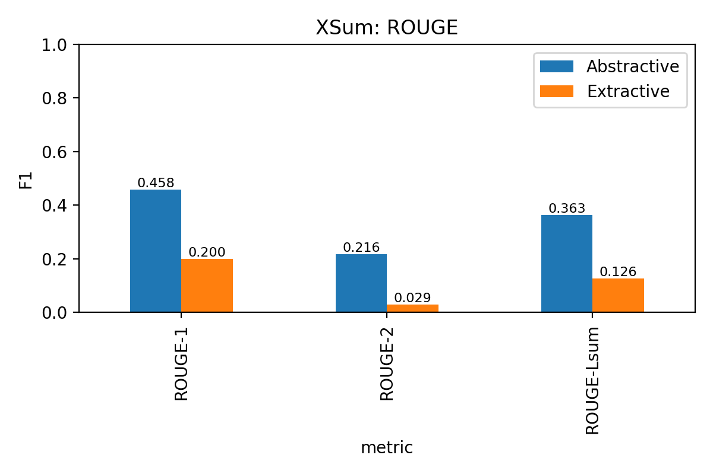
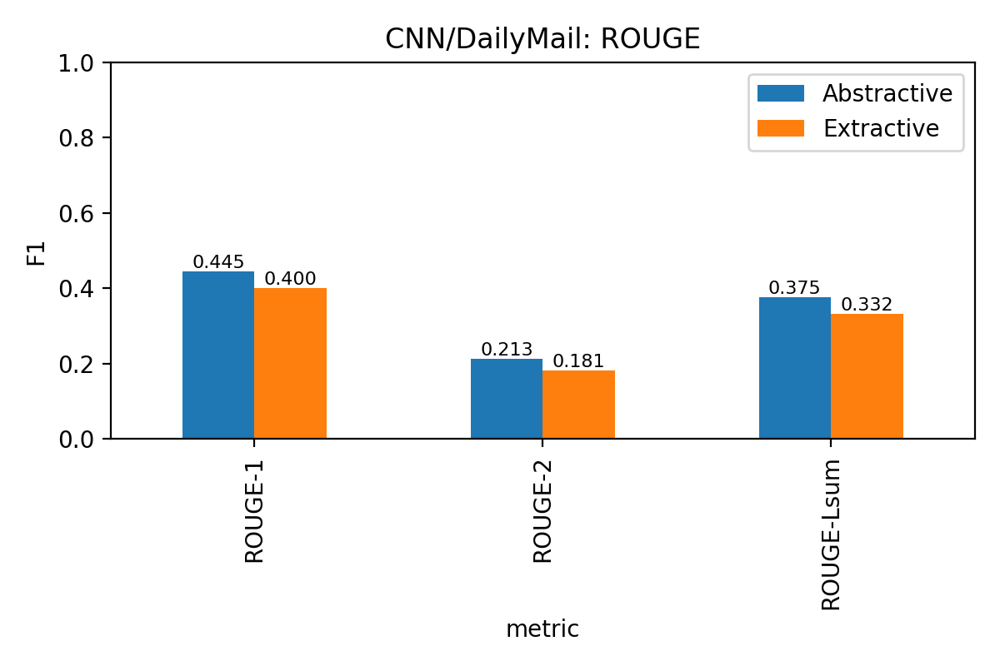

# **Smart Summarizer : A Comparative Analysis of Abstractive and Extractive Summarization**

#### Author:
Hemamalini Venkatesh Vanetha

MSADS, Clarkson University

STAT 709 - INDEPENDENT PROJECT

### One-line summary:

- A Python‑based NLP project comparing abstractive (BART‑Large) and extractive (Lead‑3) summarization on XSum and CNN/DailyMail datasets using ROUGE evaluation.

## **ABSTRACT**
Smart Summarizer is a project that turns long articles into short summaries. It focuses on two common ways to summarize text:

- Extractive summarization – picking the most important sentences directly from the article.
- Abstractive summarization - writing a new summary in natural language, like how a human would explain it.

These both methods are tested on two popular news datasets:

- XSum – which needs very short, single‑sentence summaries.

- CNN/DailyMail – which has multi‑sentence highlights.

Our project compares the results of these methods using ROUGE scores to see which approach works better for different types of articles.

## **PYTHON LIBRARIES**

To run this project, you'll need the following Python libraries:

- transformers – to use pre‑trained BART models

- datasets – to load XSum and CNN/DailyMail datasets

- rouge-score – to calculate ROUGE metrics

- pandas and numpy – for data handling

- tqdm – for progress bars

- matplotlib – (optional) to create ROUGE bar charts

## **DATASETS**

This project uses two well‑known news summarization datasets, each with its own style and challenges:

1) ### XSum (Extreme Summarization)

   - Source: BBC news articles

   - Summary Style: Very short, single‑sentence summaries that are highly abstractive

 - #### Use Case in Our Project:

    - Perfect for testing abstractive summarization because the reference summaries are written in a natural, human‑like style.

    - Simple extractive methods often perform poorly here because copying sentences is usually not enough.

2) ### CNN/DailyMail

   - Source: CNN and DailyMail news articles

   - Summary Style: Multi‑sentence highlights, often extractive or semi‑abstractive

 - #### Use Case in Our Project:

   - Ideal to test extractive baselines (Lead‑3) because news articles often start with the most important facts.

   - Abstractive models like BART‑Large‑CNN can rewrite these highlights more naturally.

#### Why these datasets?

- They are widely used benchmarks for summarization research.

- They allow us to compare model behavior on short abstractive summaries (XSum) vs. longer highlight‑style summaries (CNN/DailyMail).

## **MODELS USED**

Our project uses two types of summarization methods:

1) ### Abstractive Summarization – BART

   - BART‑Large‑XSum → Best for XSum dataset (short, single‑sentence summaries)
   - BART‑Large‑CNN → Best for CNN/DailyMail dataset (multi‑sentence summaries)

    **What is BART?**

   * BART (Bidirectional and Auto‑Regressive Transformer) is a state‑of‑the‑art NLP model by Facebook AI for text generation tasks.
   * Reads the entire article using an encoder to understand context.
   * Generates new sentences word by word using a decoder, like a human writing a summary.
   * Capable of paraphrasing and compressing text, making it perfect for abstractive summarization.

   **Why we use BART**

   * Creates human‑like, fluent summaries.
   * Performs very well on datasets that require rewriting instead of copying text.

2) ### Extractive Summarization – Lead‑3

   - Lead‑3 Baseline → Extracts the first 3 sentences of the article as the summary.

   **What is Lead‑3?**

   * A very simple extractive approach that just copies the opening sentences.
   * Works well for news articles because the most important facts usually appear first.

   **Why we use Lead-3**

   * Fast and lightweight (no model needed).
   * Surprisingly effective on CNN/DailyMail due to structured news style.

## **WORKFLOW**

The project follows a simple and clear workflow to compare abstractive and extractive summarization:

1) ### Data Loading

   - Load the XSum and CNN/DailyMail datasets using the Hugging Face datasets library.
   - Select a smaller sample size for faster testing on CPU.

2) ### Preprocessing
   - Prepare the articles and reference summaries.
   - Truncate very long articles to fit the model’s input limit.

3) ### Extractive Summarization
   - Apply the Lead‑3 baseline to generate summaries by taking the first three sentences.

4) ### Abstractive Summarization
   - Use BART‑Large‑XSum for XSum and BART‑Large‑CNN for CNN/DailyMail.
   - Generate summaries in batches to save time, especially on CPU.

5) ### Evaluation with ROUGE
   - Compare generated summaries against reference summaries using ROUGE‑1, ROUGE‑2, and ROUGE‑Lsum.
   - Record scores for both abstractive and extractive methods.

6) ### Results Storage
   - Save ROUGE tables and sample summaries into the results/ folder for review and reporting.

## **HOW TO RUN THE NOTEBOOK**

- Open the notebook - Launch Jupyter Notebook or VS Code and open smart_sum.ipynb.

- Install required libraries - Make sure all Python libraries from the Python Libraries section are installed.

- Run the notebook cells in order - Load the datasets (XSum and CNN/DailyMail), Prepare the text for summarization, Generate summaries using extractive (Lead‑3) and abstractive (BART‑Large) methods, Evaluate them with ROUGE and save the results.

- Check the results - ROUGE score CSV files for both datasets, Sample summaries showing original, reference, and generated summaries, Bar charts of ROUGE scores.

## **OUTPUT & RESULTS**

After running the notebook, the model generates summaries and evaluates them using ROUGE metrics.
Below are the results for both datasets, comparing Abstractive (BART) and Extractive (Lead‑3) methods.

1) ### XSum Results

     | Metric     | Abstractive | Extractive |
     |------------|-------------|------------|
     | ROUGE-1    | 0.457553    | 0.200073   |
     | ROUGE-2    | 0.216277    | 0.028505   |
     | ROUGE-Lsum | 0.363480    | 0.126493   |

 - ### Observation:

    - Abstractive summarization clearly outperforms extractive on XSum.

    - This is because XSum summaries are highly abstractive and only one sentence long.

      

2) ### CNN/DailyMail Results

      | Metric     | Abstractive | Extractive |
      |------------|-------------|------------|
      | ROUGE-1    | 0.445030    | 0.400021   |
      | ROUGE-2    | 0.213468    | 0.180628   |
      | ROUGE-Lsum | 0.375030    | 0.331696   |

 -  ### Observation:

     - Abstractive performs slightly better than extractive.

     - Extractive (Lead‑3) remains strong here because news articles start with the most important information.

       

## **INTERPRETING THE RESULTS**

This project is a comparative analysis of two summarization methods:

1) Abstractive (BART) → Generates new, human‑like summaries.

2) Extractive (Lead‑3) → Copies the first few sentences from the article.

After evaluating both methods on XSum and CNN/DailyMail, here is what we found:

- Abstractive summarization consistently performs better than extractive in terms of ROUGE‑1, ROUGE‑2, and ROUGE‑Lsum scores.

- Extractive Lead‑3 is fast and simple, but it cannot rewrite or compress information, which limits its performance on highly abstractive datasets.

- BART’s summaries are more natural and meaningful, while Lead‑3 often produces longer and less focused summaries.

### Comparison

| Aspect                       | Abstractive Summarization (BART)                      | Extractive Summarization (Lead‑3)                   |
|------------------------------|-------------------------------------------------------|-----------------------------------------------------|
| Summary Style                | Generates new sentences in natural language           | Copies sentences directly from the article          |
| Performance on XSum          | Excellent – captures meaning in one sentence          | Poor – struggles with very short summaries          |
| Performance on CNN/DailyMail | Slightly better than extractive – smoother & cohesive | Strong baseline because news leads contain key info |
| ROUGE‑1/2/Lsum Scores        | Higher overall on both datasets                       | Lower, but competitive on CNN/DailyMail             |
| Best Use Cases               | Human‑like summaries, abstractive content             | Structured news or when speed is more important     |

### Key Insights

1) Abstractive summarization consistently outperforms extractive on both datasets.

   - XSum: Large gap in all ROUGE scores → Abstractive is clearly superior.

   - CNN/DailyMail: Abstractive is better, but Extractive is still competitive.

2) Extractive summarization is simple but limited

   - Works decently for long, structured news articles like CNN/DailyMail.

   - Fails for datasets like XSum that require paraphrasing and abstraction.

3) Abstractive summarization is the better choice when:

   - You need short, natural, and human‑friendly summaries.

   - The dataset contains abstractive reference summaries.

4) Extractive summarization is only preferable when:

   - You need fast results with minimal computation.

   - The text is structured like news where the first sentences carry the key message.

### Which Method Works Best Overall?

- Abstractive summarization (BART) is the winner in terms of quality and ROUGE scores.

- Extractive summarization (Lead‑3) is faster and still useful for structured datasets, but less accurate in capturing the true meaning.

## **REPRODUCIBILITY & NOTES**

This project is designed to be fully reproducible with the following notes:

  * We set SEED = 42 for Python, NumPy, and PyTorch to make results consistent.

  * Runs on CPU, but GPU is recommended for faster summarization.

  * CPU uses batched inference to reduce runtime.

  * Reduce sample size in the notebook for faster testing.

  * On CPU, num_beams=2 is used for beam search to balance speed and quality.

  * Hugging Face might show symlink cache warnings; these are safe to ignore.

## **LIMITATIONS & FUTURE WORKS**

While this project gives clear insights into abstractive vs extractive summarization, there are a few limitations and possible improvements:

### Limitations

 - Limited sample size for evaluation due to CPU runtime constraints.

 - No fine‑tuning of models; results are based on pre‑trained BART only.

 - No factual correctness check; ROUGE only measures textual overlap, not if  the summary is always accurate.

### Future Work

 - Fine‑tune BART or Pegasus on a subset of data to improve performance.

 - Add faithfulness checks using Natural Language Inference (NLI) to detect hallucinations.

 - Explore hybrid methods: Use extractive summarization first to select key sentences, then feed them to an abstractive model for faster and better summaries.

 - Add more datasets for a broader comparison beyond news data.

